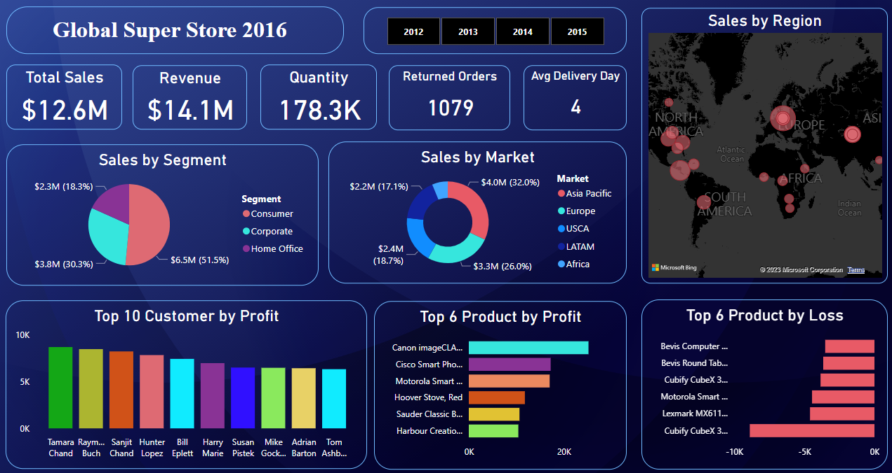
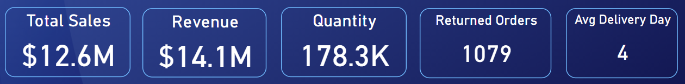
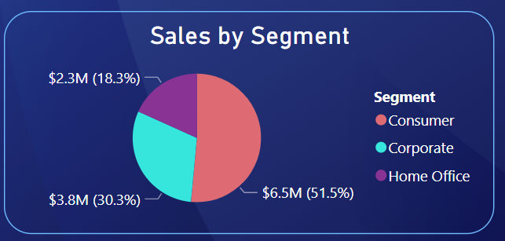
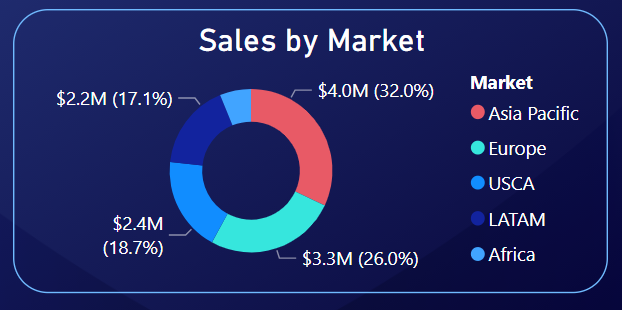
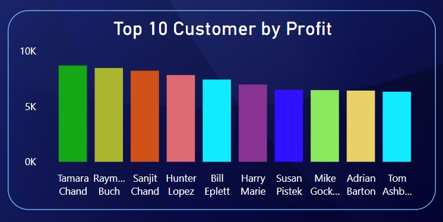
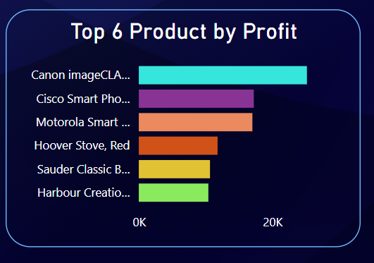
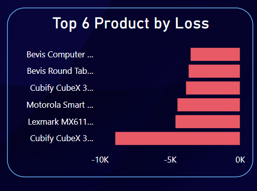
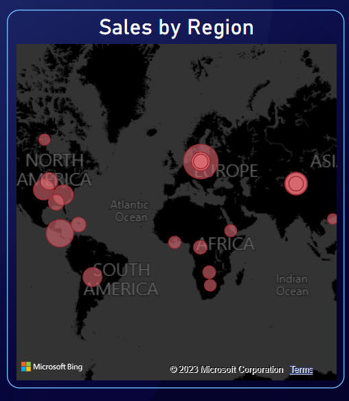
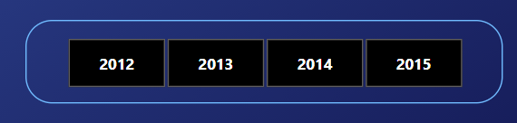

# Global Super Store 2016 Dashboard

This repository contains a Power BI dashboard for the Global Super Store 2016 dataset. The dashboard provides visualizations and insights on various sales and business metrics.

## Getting Started

To use the dashboard, follow the steps below:

1. Clone or download the repository to your local machine.

2. Ensure you have Power BI Desktop installed. If not, download it from the official Power BI website.

3. Open Power BI Desktop and navigate to "Open a Report."

4. Select the provided .pbix file from the cloned repository.

5. Explore the different visualizations and insights in the dashboard.

## Features

The Global Super Store 2016 dashboard includes the following features:

- KPIs: Key Performance Indicators (KPIs) are visual elements that summarize important metrics. The dashboard contains five KPIs to indicate the following metrics:
  - Total Sales: The overall sales amount.
  - Revenue: The total revenue generated.
  - Quantity: The total quantity of products sold.
  - Returned Orders: The number of orders returned.
  - Average Delivery Days: The average number of days taken for deliveries.

- ### Pie Chart:
       A Pie Chart visualization displays the sales breakdown by segment. It provides insights into the distribution of sales among different segments, such as Consumer,           Corporate, and Home Office.

  

- ### Donut Chart: 
      The Donut Chart visualization showcases the sales breakdown by market. It illustrates the proportion of sales from different market segments.

- ### Column Chart:
      The Column Chart visualization represents the top 10 customers by profit. It allows you to identify the customers generating the highest profits.

- ### Column Bar Charts: 
      The dashboard includes two Column Bar Charts. One shows the top 6 products by profit, allowing you to identify the most profitable products. 
      

      
   The other chart displays the top 6 products by loss, highlighting products that may require attention to improve profitability.

- ### Map: 
      The Map visualization presents the sales distribution by region. It enables you to visualize the geographical spread of sales and identify regions with high or low sales.

- ### Filter: 
      The dashboard includes a filter that allows you to focus on insights specific to a particular year. This interactive feature provides the flexibility to analyze data for different time periods.

## Dataset

The dataset used in this dashboard is the Global Super Store 2016 dataset. It includes sales data, customer information, product details, and other relevant metrics. The dataset is not included in this repository, but you can obtain it from [Dataset](https://www.youtube.com/redirect?event=video_description&redir_token=QUFFLUhqbU80b0pyQzdpRlFmRWNwenhLYS05Tm51RUFFd3xBQ3Jtc0ttMThBb0VMTnNDRXpSeG9YSE1uNXJuWUdNX0ptOFN4ckdBdmlPZ0dSWTVKUjBKdGV5Y1NfU1k3RXMySEdUazlZb05UUTFMTnpDVHF4Z05feUlXUHZYZXd4cUp6RjUyZ3BrekJ6V1FVT2xkREs0NXNjMA&q=https%3A%2F%2Fpowerbidocs.com%2Fwp-content%2Fuploads%2F2021%2F01%2Fglobal_superstore_2016.xlsx&v=et8tAUTwcvY).

## Contributing

Contributions to this project are welcome. If you would like to make any improvements or add new features, please feel free to submit a pull request.

